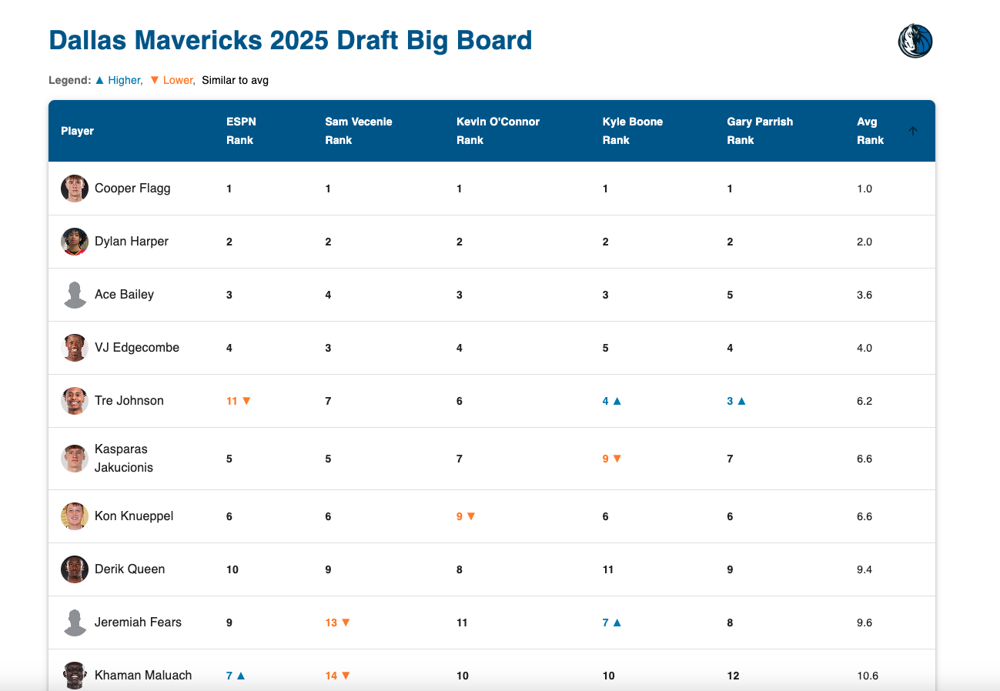

# 🏀 Mavs Draft Hub

A frontend-only NBA Draft evaluation platform tailored for the Dallas Mavericks front office. This application presents scouting data in an intuitive, interactive interface for evaluating top prospects ahead of the NBA Draft.

[🔗](https://mavsdrafthub-yash.netlify.app/)


## 🚀 Features

- **Big Board** with sortable scout rankings and average rank calculations
- **Color-coded evaluations** to highlight which scouts are higher or lower on a prospect
- **Player Profiles** featuring:
  - Measurements with percentile comparisons vs other prospects
  - Season stats viewable by category (scoring, counting, total)
  - Season-by-season stat breakdowns with team and league info
  - Official and user-submitted scouting reports
- **Responsive design** for laptop, tablet, and phone
- **Material UI** components for sleek visual presentation

## 📊 Interactivity Highlights

- **Stat View Toggle**: Users can switch between scoring, counting, and total metrics for season stats.
- **Season Dropdown**: Quickly view multi-season performance for each player.
- **Sortable Big Board Columns**: Click any scout’s column to sort by their ranking.
- **Add Your Report**: Submit new scouting notes on any prospect — saved locally via `useState`.

## 📁 Tech Stack

- [React](https://reactjs.org/)
- [Vite](https://vitejs.dev/)
- [Material UI](https://mui.com/)
- Hosted on [Netlify](https://www.netlify.com/)

## 🧠 Design Decisions

- **Percentile-based measurements** allow staff to compare prospects in context
- **Clean, fixed layout tables** reduce visual fatigue and align category/values uniformly
- **Colorblind-accessible cues** were considered for rank highlighting (e.g., using bolding and positioning in addition to color)

## 🔧 Local Development

1. Clone the repo:

```bash
git clone https://github.com/YOUR_USERNAME/mavs-draft-hub.git
cd mavs-draft-hub
```

2. Install dependencies:

```bash
npm install
```

3. Run locally:

```bash
npm run dev
```

## 🌐 Deployment

This project is deployed on Netlify using CI from the main branch of this GitHub repository. Each commit triggers an automatic redeploy.

---

## 📌 Requirements Fulfilled

✅ React + Vite frontend only  
✅ Material UI components used throughout  
✅ Sortable Big Board based on scout data  
✅ Differentiates scouts who are high/low on a player  
✅ Player Profiles w/ measurement, stats, and reports  
✅ New scouting reports added with `useState`  
✅ Input to change displayed data (stat views, season selector)  
✅ Fully data-driven — easily supports new player data  

---

## 👨‍💼 Audience

This project is designed with NBA front-office stakeholders in mind. It supports quick decision-making and deep dives without overwhelming the interface.

---

## 📬 Contact

**Yashwant Sathish Kumar**  
📧 yashwant.sathish@gmail.com  
🔗 [LinkedIn](https://www.linkedin.com/in/yashwant-sathishkumar/)